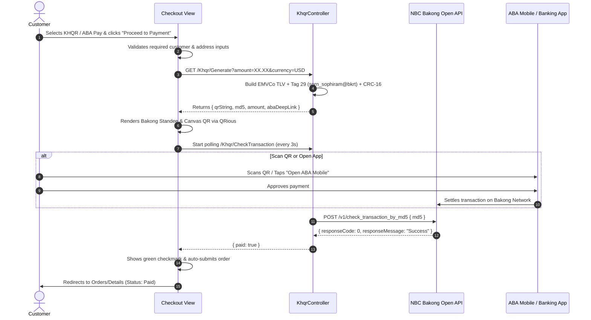

# 🛍️ CLOTHÉ — Modern Clothing E-Commerce Platform

A feature-rich, high-performance clothing e-commerce and multi-vendor marketplace platform built with **ASP.NET Core 9 (MVC)**, **Entity Framework Core**, **SQL Server**, and **Bootstrap 5**.

Featuring authentic **National Bank of Cambodia (NBC) Bakong KHQR** and **ABA Pay** payment integration with dynamic EMVCo QR code generation, real-time transaction verification, deep linking, and responsive mobile shopping.

---

## 🌟 Key Features

### 🛒 Customer Storefront
- **Modern Responsive Navbar**: Clean, minimal navigation with dropdowns, search bar (Ctrl+K shortcut), live cart count, and wishlist indicators.
- **Product Catalog & Filters**: Browse styles, collections, filter by category, brand, color, size, price range, and sale promotions.
- **Interactive Shopping Bag**: Drawer offcanvas cart with instant quantity adjustments, item removal, and subtotal calculation.
- **Customer Wishlist**: Save favorite styles and move them directly to the bag when ready.
- **Customer Account Management**: Profile overview, saved shipping addresses, and full order history tracking.

### 💳 Real Bakong KHQR & ABA Pay Integration
- **EMVCo Compliant KHQR**: Generates authentic National Bank of Cambodia (NBC) Bakong KHQR dynamic QR codes following the official EMVCo Specification v1.1.
- **ABA Mobile Deep Linking**: Directly open ABA Mobile via `aba://` deep links on mobile devices.
- **Live Transaction Verification**: Background polling via the Bakong Open API (`/v1/check_transaction_by_md5`) with Bearer token authentication to automatically verify customer payments.
- **Standee QR Card**: Realistic Cambodian banking KHQR standee with red banner, merchant name, amount in USD & KHR (exchange rate calculation), and countdown timer.
- **Save QR Image**: Customers can download high-resolution QR PNGs to scan from their photo gallery.
- **Additional Payment Methods**: Cash on Delivery (COD), ACLEDA, Wing, and manual payment options.

### 📊 Comprehensive Admin Control Panel
- **Sales & Revenue Dashboard**: Real-time analytics, revenue metrics, orders tracking, and recent activity logs.
- **Product Management**: Full CRUD for clothing products, multiple variants (color, size, SKU, price), and gallery images.
- **Inventory & Stock Tracking**: Real-time stock counts, reserved quantity, low-stock warnings, and warehouse movements.
- **Order Processing**: Track shipments, fulfillment stages, payment confirmations, and customer details.
- **Role-Based Access Control**: Granular permissions for `SuperAdmin`, `Admin`, and `Member`.

---

## 🛠️ Technology Stack

| Component | Technology |
|---|---|
| **Framework** | .NET 9.0 (ASP.NET Core MVC) |
| **ORM & Database** | Entity Framework Core 9, Microsoft SQL Server |
| **Authentication** | ASP.NET Core Identity (Roles: SuperAdmin, Admin, Member) |
| **Payment Gateway** | National Bank of Cambodia (NBC) Bakong Open API & KHQR EMVCo |
| **Frontend** | Razor Views, Bootstrap 5.3, Bootstrap Icons 1.11, QRious |
| **Typography** | Inter & Playfair Display (Google Fonts) |

---

## ⚙️ Environment Configuration (`.env`)

The project supports environment variables via a `.env` file located in the project root.

Create or edit your `.env` file with your credentials:

```env
# =========================================================
# APPLICATION CONFIGURATION
# =========================================================
SUPERADMIN_EMAIL=superadmin@clothe.com
SUPERADMIN_PASSWORD=SuperAdmin@12345

# =========================================================
# BAKONG KHQR & ABA PAY CREDENTIALS
# =========================================================
KHQR_BASE_URL=https://api-bakong.nbc.gov.kh
KHQR_TOKEN="YOUR_BAKONG_OPEN_API_JWT_TOKEN"
KHQR_ACCOUNT="sorn_sophiram@bkrt"
KHQR_MERCHANT_NAME="SOPHIRAM SORN"
KHQR_STORE_LABEL="Clothing Store"
KHQR_PHONE=0969144183
KHQR_CURRENCY=USD
KHQR_USD_TO_KHR_RATE=4100
```

> [!TIP]
> **Account ID Format & Banking App Compatibility**:
> - `sorn_sophiram@bkrt`: Bakong Retail test/sandbox environment.
> - `your_phone_or_id@abaa` (e.g. `0969144183@abaa`): Direct ABA Mobile account. If scanning with the real/production ABA Mobile app, ABA routes directly through ABA/Bakong network with zero lookup timeout.
> - The generator dynamically embeds the acquiring bank code (`bkrt`, `abaa`, `aclb`, etc.) inside Tag 29 (`02`) and transaction reference/phone/store in Tag 62.

> **Note**: If `.env` is absent, the system falls back gracefully to `appsettings.json` and default development configurations.

---

## 🚀 Getting Started

### Prerequisites
- [.NET 9.0 SDK](https://dotnet.microsoft.com/download/dotnet/9.0)
- [Microsoft SQL Server](https://www.microsoft.com/sql-server) or LocalDB
- [Visual Studio 2022](https://visualstudio.microsoft.com/) (v17.12+) or Visual Studio Code

### Installation & Run

1. **Clone the Repository**:
   ```bash
   git clone https://github.com/your-username/WebApplication_ClothingEcommerce.git
   cd WebApplication_ClothingEcommerce/WebApplication_ClothingEcommerce
   ```

2. **Configure Database Connection**:
   Update `ConnectionStrings:DefaultConnection` in `appsettings.json` or through your `.env` file:
   ```json
   "ConnectionStrings": {
     "DefaultConnection": "Server=localhost;Database=clothing_ecommer_db;Trusted_Connection=True;TrustServerCertificate=True;"
   }
   ```

3. **Apply Database Migrations & Seed**:
   ```bash
   dotnet restore
   dotnet ef database update
   ```
   *(The application also automatically runs `Database.MigrateAsync()` and seeds initial categories, brands, products, and payment methods on first launch).*

4. **Launch Application**:
   ```bash
   dotnet run
   ```
   Open your browser at `https://localhost:44346` or `http://localhost:5000`.

---

## 🔐 Default Access Accounts

| Role | Email | Password | Access Level |
|---|---|---|---|
| **SuperAdmin** | `superadmin@clothe.com` | `SuperAdmin@12345` | Full administrative control & settings |
| **Store Admin** | `admin@clothing.com` | `Admin@123` | Catalog, inventory, and order operations |
| **Demo Customer** | `customer@clothing.com` | `Customer@123` | Storefront shopper |

---

## 📂 Project Architecture

```
WebApplication_ClothingEcommerce/
├── Areas/
│   └── Admin/                 # Admin Control Panel (Controllers & Views)
│       ├── Controllers/       # Products, Orders, Inventory, Admins, etc.
│       └── Views/             # Admin management interfaces
├── Controllers/               # Public Storefront Controllers
│   ├── HomeController.cs      # Homepage & landing showcase
│   ├── ShopController.cs      # Product catalog, browsing & filters
│   ├── CartController.cs      # Cart operations & drawer endpoints
│   ├── CheckoutController.cs  # Multi-route checkout (/Checkout, /Checkout/Index, /Checkout/Checkout)
│   ├── KhqrController.cs      # NBC Bakong KHQR generator & live verification
│   ├── OrdersController.cs    # Customer order tracking & receipts
│   ├── WishlistController.cs  # Wishlist management
│   └── ProfileController.cs   # User profile & saved addresses
├── Data/
│   ├── AppDbContext.cs        # EF Core database context
│   ├── AppDbInitializer.cs   # Automated migration & realistic seed data
│   └── Enums/                 # OrderStatus, PaymentStatus, etc.
├── Models/                    # Entity Models & ViewModels
│   ├── Product.cs, Variant.cs # Clothing catalog models
│   ├── Order.cs, Payment.cs   # Transactions & shipments
│   └── ViewModels/            # CheckoutViewModel, CartViewModel, etc.
├── Services/                  # Business Logic Layer
│   ├── OrderService.cs        # Atomic order transactions & stock deductions
│   ├── PaymentService.cs      # Payment method processing
│   ├── CartService.cs         # Shopping cart state management
│   └── ...                    # Inventory, Product, Customer services
├── Views/                     # Customer Storefront Razor Views
│   ├── Checkout/Index.cshtml  # Standee KHQR modal, form auto-validation
│   ├── Cart/Index.cshtml      # Shopping bag interface
│   └── Shared/                # _Layout.cshtml, _CartSidebar.cshtml, nav components
├── wwwroot/                   # Static assets (CSS, JS, images, logos)
├── .env                       # Environment variables (KHQR credentials)
└── Program.cs                 # App bootstrap, .env loader, DI container
```

---

## 💳 KHQR Payment Architecture



---

## 📄 License & Disclaimer

Built for academic and commercial e-commerce development. 
The KHQR standard is maintained by the **National Bank of Cambodia (NBC)**. All registered trademarks and logos belong to their respective institutions.
