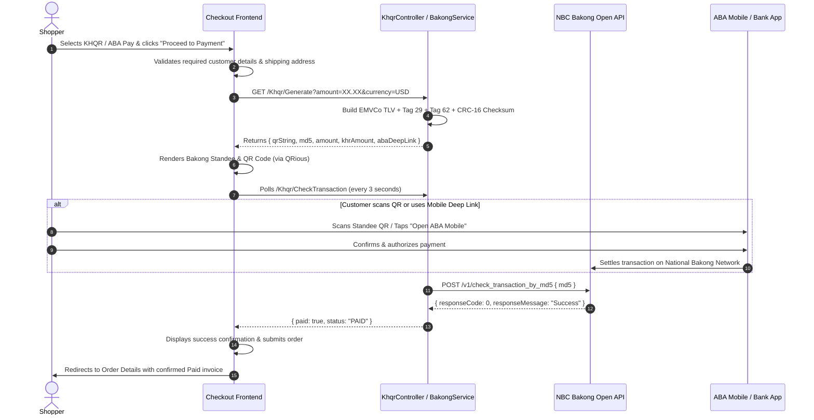

# 🛍️ CLOTHÉ — Modern Clothing E-Commerce Platform

A production-ready, high-performance clothing e-commerce and multi-vendor platform built with **ASP.NET Core 9 (MVC)**, **Entity Framework Core 9**, **Microsoft SQL Server**, and **Bootstrap 5.3**.

Featuring authentic **National Bank of Cambodia (NBC) Bakong KHQR** and **ABA Pay** payment integration with dynamic EMVCo QR code generation, real-time transaction verification, Google OAuth 2.0 authentication, Telegram bot alerts, and multi-channel email notifications.

---

## 🌟 Key Features

### 🛒 Customer Storefront
- **Modern Responsive UI**: Clean, contemporary design with drawer offcanvas shopping bag, quick-search modal (`Ctrl+K`), live cart counter, and wishlist badges.
- **Product Catalog & Faceted Filters**: Browse styles and collections with instant filtering by category, brand, color, size, price range, and sale promotions.
- **Interactive Shopping Bag**: Drawer cart sidebar with real-time quantity adjustments, item removals, and dynamic subtotal calculations.
- **Customer Wishlist**: Save favorite items and transfer them directly into the shopping bag.
- **Customer Portal**: Account profile overview, profile avatar uploads (with format validation and size limits), saved delivery addresses, and full order history tracking.
- **Contact & Feedback**: Responsive Contact page for customer inquiries with automatic email and Telegram notifications routed to administrators.

### 💳 Real NBC Bakong KHQR & ABA Pay Integration
- **EMVCo Compliant KHQR**: Generates authentic National Bank of Cambodia (NBC) Bakong KHQR dynamic QR codes adhering to the official EMVCo Specification v1.1.
- **Dual Currency Support**: Dynamic calculations for both **USD** and **KHR** using configurable exchange rates.
- **ABA Mobile Deep Linking**: Mobile checkout automatically provides `aba://` deep links to open ABA Mobile directly for one-tap payments.
- **Live Transaction Verification**: Background client polling calling the NBC Bakong Open API (`/v1/check_transaction_by_md5`) with Bearer token authentication to automatically verify customer payment settlement.
- **Authentic Standee QR**: High-fidelity Cambodian banking standee modal with red Bakong header, merchant credentials, animated status indicator, and countdown timer.
- **Downloadable QR Code**: Shoppers can save high-resolution QR images to scan directly from their mobile banking photo gallery.
- **Development Sandbox Simulation**: Controlled sandbox simulation for local offline testing (strictly locked to Development mode and requires Admin authorization).
- **Alternative Payment Methods**: Support for Cash on Delivery (COD), ACLEDA, Wing, and manual bank transfers.

### 🔐 Security & Identity
- **Google OAuth 2.0**: Optional external authentication with Google Sign-In alongside standard ASP.NET Core Identity.
- **Role-Based Access Control (RBAC)**: Partitioned permission tiers for `SuperAdmin`, `Admin`, and `User`.
- **Hardened HTTP Security Headers**: Built-in production headers including `X-Frame-Options: SAMEORIGIN`, `X-Content-Type-Options: nosniff`, `X-XSS-Protection`, `Referrer-Policy: strict-origin-when-cross-origin`, and `Content-Security-Policy`.
- **HSTS & HTTPS Redirection**: Enforced SSL/TLS and strict transport security in production environments.
- **Secure Cookie Policies**: Essential session cookies configured with `HttpOnly`, `SameSiteMode.Lax`, and `SecurePolicy = Always`.
- **Strict File Upload Validation**: Avatar and image uploads enforce strict whitelist extensions (`.jpg`, `.jpeg`, `.png`, `.webp`), 5MB maximum file sizes, and server-generated UUID paths to prevent path traversal attacks.
- **Git Secret Hygiene**: Fully isolated `.env` configuration file with comprehensive `.env.example` template; secrets and build artifacts are strictly ignored in `.gitignore`.

### 📢 Multi-Channel Notifications & Alerts
- **Admin In-App Notifications**: Real-time notification menu in the admin dashboard for new customer orders, contact inquiries, and low-stock alerts.
- **Telegram Bot Integration**: Instant alerts pushed directly to Telegram groups or channels for newly placed orders and customer contact messages.
- **Email Notifications (SMTP)**: Automated transactional emails for order confirmations, payment receipts, shipment updates, and admin alerts with SSL/TLS support (compatible with Gmail App Passwords).

### 📊 Comprehensive Admin Control Panel (`/Admin`)
- **Dashboard & Analytics**: Live revenue stats, order status distribution, sales velocity metrics, and recent activity logs.
- **Product & Variant Catalog**: Full CRUD for clothing items, multiple variant matrixes (Color, Size, SKU, barcode, price adjustment), and image galleries.
- **Inventory Tracking**: Real-time stock counts, reserved units, low-stock warnings, and inventory adjustment history.
- **Order Fulfillment**: Complete order lifecycle management (Pending, Paid, Processing, Shipped, Delivered, Cancelled).
- **Dual-Currency Invoices**: Printable and downloadable HTML/PDF invoices with custom store branding, company logo, and bilingual English/Khmer store notes and policies.
- **Store & Receipt Settings**: Manage company branding, contact details, default currency, exchange rates, and return policy disclaimers.
- **Audit Logs & Security**: Track administrative actions and system events for compliance.

---

## 🛠️ Technology Stack

| Layer | Technology |
|---|---|
| **Framework** | .NET 9.0 (ASP.NET Core MVC) |
| **Data Access & ORM** | Entity Framework Core 9 (Code-First) |
| **Database** | Microsoft SQL Server (LocalDB / Express / Docker) |
| **Authentication & RBAC** | ASP.NET Core Identity + Google OAuth 2.0 |
| **Payment Gateway** | National Bank of Cambodia (NBC) Bakong Open API & EMVCo KHQR |
| **External Messaging** | Telegram Bot API (`HttpClientFactory`) & SMTP (`System.Net.Mail` / MailKit) |
| **Frontend & Styling** | Razor Views, Bootstrap 5.3, Bootstrap Icons 1.11, QRious |
| **Typography** | Inter & Playfair Display (Google Fonts) |
| **Containerization** | Docker & Docker Compose |

---

## ⚙️ Environment Configuration (`.env`)

The application loads environment variables at startup via a local `.env` file. A complete template is provided in [`.env.example`](.env.example).

### Setup Your Environment

1. Copy the example template:
   ```bash
   cp .env.example .env
   ```

2. Open `.env` and fill in your environment credentials:

```env
# =========================================================================
# APPLICATION ENVIRONMENT
# =========================================================================
ASPNETCORE_ENVIRONMENT=Development
DefaultConnection="Server=localhost;Database=ClothingEcommerceDb;Trusted_Connection=True;MultipleActiveResultSets=true;TrustServerCertificate=True"

# =========================================================================
# INITIAL SUPERADMIN ACCOUNT
# =========================================================================
SUPERADMIN_EMAIL="superadmin@clothe.com"
SUPERADMIN_PASSWORD="your_strong_superadmin_password"

# =========================================================================
# GOOGLE OAUTH 2.0 (Optional)
# =========================================================================
GOOGLE_CLIENT_ID="your_google_client_id.apps.googleusercontent.com"
GOOGLE_CLIENT_SECRET="your_google_client_secret"

# =========================================================================
# NBC BAKONG KHQR PAYMENT GATEWAY
# =========================================================================
BAKONG_ACCOUNT_ID="your_account@bkrt"
BAKONG_MERCHANT_NAME="Your Store Name"
BAKONG_MERCHANT_CITY="Phnom Penh"
BAKONG_PHONE="012345678"
BAKONG_STORE_LABEL="CLOTHÉ Phnom Penh"
BAKONG_CURRENCY="USD"
BAKONG_USD_TO_KHR_RATE="4100"
BAKONG_BASE_URL="https://api-bakong.nbc.gov.kh"
BAKONG_TOKEN="your_bakong_open_api_jwt_token"

# =========================================================================
# TELEGRAM BOT NOTIFICATIONS
# =========================================================================
TELEGRAM_BOT_TOKEN="your_telegram_bot_token"
TELEGRAM_BOT_USERNAME="your_telegram_bot_username"
TELEGRAM_CHAT_ID="your_telegram_chat_id"

# =========================================================================
# SMTP EMAIL SERVICE
# =========================================================================
MAIL_HOST="smtp.gmail.com"
MAIL_PORT="465"
MAIL_USERNAME="your_email@gmail.com"
MAIL_PASSWORD="your_16_char_app_password"
MAIL_FROM_ADDRESS="your_email@gmail.com"
MAIL_FROM_NAME="CLOTHÉ Clothing Store"
MAIL_ENCRYPTION="ssl"
MAIL_ADMIN_EMAIL="admin@clothe.com"
```

> [!TIP]
> **Bakong Account IDs**:
> - `your_account@bkrt`: Bakong Retail sandbox/test environment.
> - `your_account@abaa` (e.g. `0969144183@abaa`): Direct ABA Mobile account. In production, ABA routes directly through the ABA/Bakong network with zero lookup delays.

---

## 🚀 Getting Started

### Prerequisites
- [.NET 9.0 SDK](https://dotnet.microsoft.com/download/dotnet/9.0)
- [Microsoft SQL Server](https://www.microsoft.com/sql-server) or LocalDB
- [Visual Studio 2022](https://visualstudio.microsoft.com/) (v17.12+) or Visual Studio Code with C# Dev Kit
- (Optional) [Docker Desktop](https://www.docker.com/products/docker-desktop/)

---

### Local Development Setup

1. **Clone the Repository**:
   ```bash
   git clone https://github.com/Sophiram/clothing_ecommerce_csharp.git
   cd clothing_ecommerce_csharp/WebApplication_ClothingEcommerce
   ```

2. **Configure Environment**:
   ```bash
   cp .env.example .env
   # Edit .env with your connection string and settings
   ```

3. **Restore & Build**:
   ```bash
   dotnet restore
   dotnet build
   ```

4. **Database Migrations & Seed**:
   ```bash
   dotnet ef database update
   ```
   *(Note: The application automatically calls `Database.MigrateAsync()` and seeds initial categories, brands, products, roles, and settings on startup).*

5. **Run the Application**:
   ```bash
   dotnet run
   ```
   Navigate to `https://localhost:7000` or `http://localhost:5000` in your browser.

---

### Running with Docker Compose

To spin up both the ASP.NET Core application and a SQL Server container:

```bash
# 1. Set DB_PASSWORD in your environment or .env
export DB_PASSWORD="YourStrongPassword123!"

# 2. Build and launch services
docker-compose up -d --build
```

Access the application at `http://localhost:8080`.

---

## 🔐 Default Access Accounts (Development)

| Role | Email | Password | Access Scope |
|---|---|---|---|
| **SuperAdmin** | `superadmin@clothe.com` | `SuperAdmin@Dev2026!` *(or via `SUPERADMIN_PASSWORD`)* | Full administrative privileges, user management, audit logs, store settings |
| **Admin** | `admin@clothe.com` | `Admin@12345` | Catalog, inventory, order processing, and reports |
| **Demo Customer** | `john.doe@gmail.com` | `User@123` | Storefront shopping, order history, wishlist |

---

## 📂 Project Structure

```
WebApplication_ClothingEcommerce/
├── Areas/
│   └── Admin/                     # Admin Control Panel
│       ├── Controllers/           # 34 Admin Controllers (Products, Orders, Roles, etc.)
│       └── Views/                 # Admin Dashboard & Management UI
├── Controllers/                   # Storefront MVC & API Controllers
│   ├── Api/                       # REST APIs (BakongPaymentsApiController)
│   ├── AccountController.cs       # Login, Register, Google OAuth
│   ├── CartController.cs          # Shopping cart & drawer operations
│   ├── CheckoutController.cs      # Multi-step checkout & payment processing
│   ├── HomeController.cs          # Landing page showcase & contact form
│   ├── KhqrController.cs          # EMVCo KHQR generation & live status polling
│   ├── OrdersController.cs        # Customer order tracking & receipts
│   ├── ProfileController.cs       # User profile, avatars, addresses
│   ├── ShopController.cs          # Catalog, faceted filters, product details
│   └── WishlistController.cs      # Wishlist operations
├── Data/                          # Database Layer
│   ├── AppDbContext.cs            # EF Core DbContext
│   ├── AppDbInitializer.cs       # Automatic migrations & seed data
│   └── Repositories/              # Generic & specific repositories + Unit of Work
├── Models/                        # Domain Entities & ViewModels
│   ├── Product.cs, ProductVariant.cs, Category.cs, Brand.cs
│   ├── Order.cs, OrderItem.cs, Payment.cs, Shipment.cs
│   └── ViewModels/                # Strongly-typed UI models
├── Services/                      # Application Business Logic Layer
│   ├── BakongPaymentService.cs    # Transaction reconciliation & API integration
│   ├── EmailService.cs            # Transactional SMTP email delivery
│   ├── KhqrService.cs             # EMVCo TLV string & CRC-16 generation
│   ├── OrderService.cs            # Atomic order placement & inventory reduction
│   ├── TelegramService.cs         # Telegram bot push notifications
│   ├── StoreSettingsService.cs    # Store branding & invoice configurations
│   └── ...                        # Inventory, Cart, Product, Avatar services
├── Views/                         # Customer Storefront Razor Views
│   ├── Checkout/Index.cshtml      # Standee KHQR modal & validation
│   ├── Home/                      # Index, About, Contact
│   ├── Shared/                    # _Layout.cshtml, _CartSidebar.cshtml, navigation
│   └── Shop/                      # Catalog browsing & product details
├── wwwroot/                       # Static web assets (CSS, JS, logos, images)
├── .env.example                   # Safe template for environment variables
├── docker-compose.yml             # Docker deployment recipe
└── Program.cs                     # Application bootstrap, DI configuration, middleware
```

---

## 💳 KHQR Payment Architecture



---

## 📄 License & Disclaimer

Built for modern e-commerce engineering and educational demonstration.  
The **KHQR** standard and specifications are maintained by the **National Bank of Cambodia (NBC)**. All respective banking trademarks and logos belong to their respective institutions.
