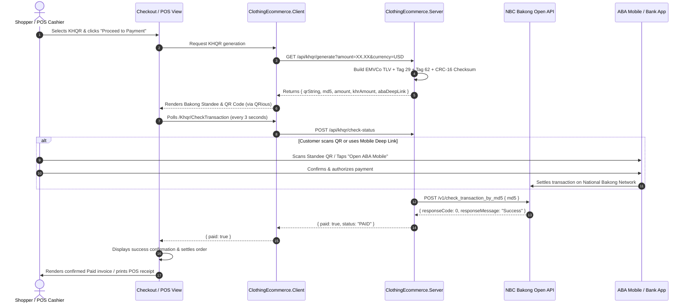

# 🛍️ CLOTHÉ — Modern Clothing E-Commerce & POS Platform

A production-ready, high-performance clothing e-commerce, Point of Sale (POS), and multi-vendor platform built with **.NET 9 (ASP.NET Core MVC & Web API)**, **Entity Framework Core 9**, **Microsoft SQL Server**, and **Bootstrap 5.3**.

Featuring authentic **National Bank of Cambodia (NBC) Bakong KHQR** and **ABA Pay** payment integration with dynamic EMVCo QR code generation, real-time transaction verification, Google OAuth 2.0 authentication, real-time POS cash register, Telegram bot alerts, and multi-channel transactional email notifications.

---

## 🌟 System Architecture

CLOTHÉ is structured into a clean, decoupled multi-tier architecture:

```
┌────────────────────────────────────────────────────────────────────────┐
│                        ClothingEcommerce.slnx                          │
├───────────────────────────────┬────────────────────────────────────────┤
│  ClothingEcommerce.Client     │  • ASP.NET Core 9 MVC Storefront       │
│  (Port 5000 / 7000)           │  • Customer Portal & Profile Dashboard │
│                               │  • Admin Control Panel & POS Terminal  │
│                               │  • Communicates with Server via API    │
├───────────────────────────────┼────────────────────────────────────────┤
│  ClothingEcommerce.Server     │  • ASP.NET Core 9 Web API              │
│  (Port 5001 / 7001)           │  • EF Core 9 Code-First + SQL Server   │
│                               │  • ASP.NET Core Identity + Google Auth │
│                               │  • NBC Bakong KHQR & ABA Pay Engine    │
│                               │  • Telegram Bot & SMTP Email Services  │
├───────────────────────────────┼────────────────────────────────────────┤
│  ClothingEcommerce.Shared     │  • Cross-cutting DTOs & Contracts      │
│                               │  • Catalog, Orders, KHQR, Profile DTOs │
└───────────────────────────────┴────────────────────────────────────────┘
```

---

## 🌟 Key Features

### 🛒 Customer Storefront (`http://localhost:5000`)
- **Modern Responsive Design**: Minimalist layout with drawer offcanvas shopping bag, quick-search modal (`Ctrl+K`), live cart counter, and wishlist badges.
- **Product Catalog & Faceted Filters (`/Shop`)**: Instant filtering by category hierarchy, brand, size, color, price range, in-stock availability, and on-sale promotions with dynamic sorting options.
- **Product Details (`/Shop/Details/{id}`)**: Interactive color and size variant matrix, live stock indicators, image gallery, and related product recommendations.
- **Interactive Shopping Bag (`/Cart`)**: Drawer cart sidebar with real-time quantity adjustments, item removals, and dynamic subtotal calculations.
- **Customer Wishlist (`/Wishlist`)**: Save favorite items and transfer them directly into the shopping bag.
- **Customer Account Portal (`/Profile`)**:
  - Profile overview and personal info management.
  - Avatar image upload with file extension and size validation.
  - Delivery address book (add, edit, delete, and set default shipping address).
  - Account security & password change.
  - Order history tracking and invoice download.
- **Contact & Inquiries (`/Home/Contact`)**: Contact form with automated notifications routed to administrators via Email and Telegram.

### 💳 Real NBC Bakong KHQR & ABA Pay Integration
- **EMVCo Compliant KHQR**: Generates authentic National Bank of Cambodia (NBC) Bakong KHQR dynamic QR codes conforming to the EMVCo Specification v1.1.
- **Dual Currency Support**: Dynamic calculations for both **USD** and **KHR** using configurable real-time exchange rates.
- **ABA Mobile Deep Linking**: Mobile checkout provides `aba://` deep links to open ABA Mobile directly for one-tap payments.
- **Live Transaction Verification**: Client background polling calling the NBC Bakong Open API (`/v1/check_transaction_by_md5`) with Bearer token authentication to automatically verify customer payment settlement.
- **Authentic Standee QR**: High-fidelity Cambodian banking standee modal with red Bakong header, merchant credentials, animated status indicator, and countdown timer.
- **Downloadable QR Code**: Shoppers can save high-resolution QR images to scan directly from their mobile banking photo gallery.
- **Development Sandbox Simulation**: Controlled sandbox simulation for local offline testing (locked to Development mode).
- **Alternative Payment Methods**: Cash on Delivery (COD), ACLEDA, Wing, and manual bank transfers.

### 🖥️ Point of Sale (POS) System (`/Admin/Pos`)
- **Fast Checkout Register**: Designed for retail counter staff and cashiers.
- **Barcode & SKU Scanning**: Quick product lookup with instant variant selection (Size, Color).
- **Dynamic Order Calculation**: Real-time subtotals, custom discounts, and tax computation.
- **Dual Payment Processing**:
  - **Cash Checkout**: Built-in cash tender calculator showing change return in USD and KHR.
  - **Live Bakong KHQR**: Dynamic customer-facing KHQR modal displayed directly on POS screen with live settlement detection.
- **Thermal Receipt Printing**: Printable POS receipts formatted for standard 80mm/58mm thermal receipt printers.

### 📊 Comprehensive Admin Control Panel (`/Admin`)
- **Executive Dashboard**: Real-time sales analytics, revenue metrics, order status distribution, sales velocity, and recent activity logs.
- **Catalog Management**: Full CRUD for Products, Categories, Brands, Sizes, Colors, and Variant Matrixes (SKU, barcode, price adjustment, image gallery).
- **Inventory Tracking**: Real-time stock counts, reserved units, low-stock alerts, and manual inventory adjustments.
- **Order Fulfillment**: Complete lifecycle management (Pending, Paid, Processing, Shipped, Delivered, Cancelled).
- **Dual-Currency Invoices**: Printable and downloadable HTML/PDF invoices with store branding, company logo, and bilingual English/Khmer store notes.
- **Store & Receipt Settings**: Manage company branding, contact details, default currency, exchange rates, and return policy disclaimers.
- **Audit Logs & Security**: Comprehensive event tracking for administrative operations.

### 🔐 Security & Identity
- **Google OAuth 2.0**: External Google Sign-In alongside standard ASP.NET Core Identity.
- **Role-Based Access Control (RBAC)**: Partitioned permission tiers for `SuperAdmin`, `Admin`, and `User`.
- **Hardened HTTP Security Headers**: Production-ready headers including `X-Frame-Options`, `X-Content-Type-Options`, `X-XSS-Protection`, `Referrer-Policy`, and `Content-Security-Policy`.
- **HSTS & HTTPS Redirection**: Enforced SSL/TLS and strict transport security in production environments.
- **Secure Cookie Policies**: Essential session cookies configured with `HttpOnly`, `SameSiteMode.Lax`, and `SecurePolicy = Always`.
- **Strict File Upload Validation**: Avatar and product image uploads enforce strict whitelist extensions (`.jpg`, `.jpeg`, `.png`, `.webp`), 5MB maximum file sizes, and server-generated UUID paths.
- **Git Secret Hygiene**: Fully isolated `.env` configuration file with comprehensive `.env.example` template; secrets and build artifacts are strictly ignored in `.gitignore`.

### 📢 Multi-Channel Notifications & Alerts
- **Admin In-App Notifications**: Real-time notification menu in the admin dashboard for new customer orders, contact inquiries, and low-stock alerts.
- **Telegram Bot Integration**: Instant alerts pushed directly to Telegram groups or channels for newly placed orders and customer contact messages.
- **Email Notifications (SMTP)**: Automated transactional emails for order confirmations, payment receipts, shipment updates, and admin alerts with SSL/TLS support.

---

## 🛠️ Technology Stack

| Layer | Technology |
|---|---|
| **Framework** | .NET 9.0 (ASP.NET Core MVC & ASP.NET Core Web API) |
| **Data Access & ORM** | Entity Framework Core 9 (Code-First) |
| **Database** | Microsoft SQL Server (LocalDB / Express / Docker) |
| **Authentication & RBAC** | ASP.NET Core Identity + Google OAuth 2.0 |
| **Payment Gateway** | National Bank of Cambodia (NBC) Bakong Open API & EMVCo KHQR |
| **Point of Sale (POS)** | Real-time POS register with instant KHQR & Cash change calculator |
| **External Messaging** | Telegram Bot API (`HttpClientFactory`) & SMTP (`System.Net.Mail` / MailKit) |
| **Frontend & Styling** | Razor Views, Bootstrap 5.3, Bootstrap Icons 1.11, QRious |
| **Typography** | Inter & Playfair Display (Google Fonts) |
| **Containerization** | Docker & Docker Compose |

---

## ⚙️ Environment Configuration (`.env`)

The application loads environment variables at startup via a local `.env` file. A complete template is provided in [`.env.example`](.env.example).

### Setup Your Environment

1. Copy the example template:
   ```bash
   cp .env.example .env
   ```

2. Open `.env` and fill in your environment credentials:

```env
# =========================================================================
# APPLICATION ENVIRONMENT
# =========================================================================
ASPNETCORE_ENVIRONMENT=Development
DefaultConnection="Server=localhost;Database=ClothingEcommerceDb;Trusted_Connection=True;MultipleActiveResultSets=true;TrustServerCertificate=True"

# =========================================================================
# INITIAL SUPERADMIN ACCOUNT
# =========================================================================
SUPERADMIN_EMAIL="superadmin@clothe.com"
SUPERADMIN_PASSWORD="SuperAdmin@Dev2026!"

# =========================================================================
# GOOGLE OAUTH 2.0 (Optional)
# =========================================================================
GOOGLE_CLIENT_ID="your_google_client_id.apps.googleusercontent.com"
GOOGLE_CLIENT_SECRET="your_google_client_secret"

# =========================================================================
# NBC BAKONG KHQR PAYMENT GATEWAY
# =========================================================================
BAKONG_ACCOUNT_ID="your_account@bkrt"
BAKONG_MERCHANT_NAME="CLOTHÉ Phnom Penh"
BAKONG_MERCHANT_CITY="Phnom Penh"
BAKONG_PHONE="012345678"
BAKONG_STORE_LABEL="CLOTHÉ Flagship Store"
BAKONG_CURRENCY="USD"
BAKONG_USD_TO_KHR_RATE="4100"
BAKONG_BASE_URL="https://api-bakong.nbc.gov.kh"
BAKONG_TOKEN="your_bakong_open_api_jwt_token"

# =========================================================================
# TELEGRAM BOT NOTIFICATIONS
# =========================================================================
TELEGRAM_BOT_TOKEN="your_telegram_bot_token"
TELEGRAM_BOT_USERNAME="your_telegram_bot_username"
TELEGRAM_CHAT_ID="your_telegram_chat_id"

# =========================================================================
# SMTP EMAIL SERVICE
# =========================================================================
MAIL_HOST="smtp.gmail.com"
MAIL_PORT="465"
MAIL_USERNAME="your_email@gmail.com"
MAIL_PASSWORD="your_16_char_app_password"
MAIL_FROM_ADDRESS="your_email@gmail.com"
MAIL_FROM_NAME="CLOTHÉ Clothing Store"
MAIL_ENCRYPTION="ssl"
MAIL_ADMIN_EMAIL="admin@clothe.com"
```

> [!TIP]
> **Bakong Account IDs**:
> - `your_account@bkrt`: Bakong Retail sandbox/test environment.
> - `your_account@abaa` (e.g. `0969144183@abaa`): Direct ABA Mobile account. In production, ABA routes directly through the ABA/Bakong network with zero lookup delays.

---

## 🚀 Getting Started

### Prerequisites
- [.NET 9.0 SDK](https://dotnet.microsoft.com/download/dotnet/9.0)
- [Microsoft SQL Server](https://www.microsoft.com/sql-server) or LocalDB
- [Visual Studio 2022](https://visualstudio.microsoft.com/) (v17.12+) or Visual Studio Code with C# Dev Kit
- (Optional) [Docker Desktop](https://www.docker.com/products/docker-desktop/)

---

### Local Development Setup

1. **Clone the Repository**:
   ```bash
   git clone https://github.com/Sophiram/clothing_ecommerce_csharp.git
   cd clothing_ecommerce_csharp/WebApplication_ClothingEcommerce
   ```

2. **Configure Environment**:
   ```bash
   cp .env.example .env
   # Edit .env with your connection string and settings
   ```

3. **Restore & Build the Solution**:
   ```bash
   dotnet restore ClothingEcommerce.slnx
   dotnet build ClothingEcommerce.slnx
   ```

4. **Database Migrations & Seed**:
   ```bash
   dotnet ef database update --project ClothingEcommerce.Server
   ```
   *(Note: The server automatically calls `Database.MigrateAsync()` and seeds initial categories, brands, products, sizes, colors, roles, and settings on startup).*

5. **Run the Services**:

   Open two terminal windows:

   **Terminal 1 — Backend Web API:**
   ```bash
   dotnet run --project ClothingEcommerce.Server --launch-profile "http"
   ```
   - Running at: `http://localhost:5001`
   - Swagger Documentation: `http://localhost:5001/swagger`

   **Terminal 2 — Frontend Storefront & Admin:**
   ```bash
   dotnet run --project ClothingEcommerce.Client --launch-profile "http"
   ```
   - Storefront running at: `http://localhost:5000`
   - Admin Panel running at: `http://localhost:5000/Admin`
   - POS Terminal running at: `http://localhost:5000/Admin/Pos`

---

### Running with Docker Compose

To spin up the solution and SQL Server in containers:

```bash
# 1. Set DB_PASSWORD in your environment or .env
export DB_PASSWORD="YourStrongPassword123!"

# 2. Build and launch services
docker-compose up -d --build
```

Access the application at `http://localhost:8080`.

---

## 🔐 Default Access Accounts (Development)

| Role | Email | Password | Access Scope |
|---|---|---|---|
| **SuperAdmin** | `superadmin@clothe.com` | `SuperAdmin@Dev2026!` *(or via `SUPERADMIN_PASSWORD`)* | Full administrative privileges, user management, audit logs, store settings |
| **Admin** | `admin@clothe.com` | `Admin@12345` | Catalog, inventory, POS register, order processing, and reports |
| **Demo Customer** | `john.doe@gmail.com` | `User@123` | Storefront shopping, profile management, order history, wishlist |

---

## 📂 Project Structure

```
WebApplication_ClothingEcommerce/
├── ClothingEcommerce.slnx             # Visual Studio / .NET Solution
│
├── ClothingEcommerce.Server/          # Backend Web API (Port 5001)
│   ├── Controllers/Api/               # REST APIs
│   │   ├── AuthController.cs          # Token & identity operations
│   │   ├── ProductsController.cs      # Product catalog & faceted search
│   │   ├── CategoriesController.cs    # Category tree endpoints
│   │   ├── BrandsController.cs        # Brand facets
│   │   ├── CatalogMetadataControllers.cs # Sizes & Colors endpoints
│   │   ├── ProfileController.cs       # Customer profile, addresses & avatar
│   │   ├── OrdersController.cs        # Order submission & lifecycle
│   │   ├── PosApiController.cs        # Point of Sale transaction API
│   │   └── BakongPaymentsApiController.cs # KHQR generation & transaction verification
│   ├── Data/                          # EF Core DbContext, Migrations & Seed Data
│   ├── Services/                      # KHQR, Bakong, Telegram, Email, Order services
│   └── Program.cs                     # API server startup & configuration
│
├── ClothingEcommerce.Client/          # Frontend Storefront & Admin (Port 5000)
│   ├── Areas/Admin/                   # Admin Control Panel & POS
│   │   ├── Controllers/               # Dashboard, Products, Orders, POS, Settings
│   │   └── Views/                     # Admin management & POS register UI
│   ├── Controllers/                   # Storefront MVC Controllers
│   │   ├── HomeController.cs          # Landing page showcase & contact
│   │   ├── ShopController.cs          # Catalog, faceted filters, product details
│   │   ├── CartController.cs          # Shopping cart & drawer operations
│   │   ├── CheckoutController.cs      # Multi-step checkout & payment processing
│   │   ├── KhqrController.cs          # Standee KHQR modal & polling proxy
│   │   ├── OrdersController.cs        # Customer order tracking & receipts
│   │   ├── ProfileController.cs       # Customer profile, addresses, avatars
│   │   └── WishlistController.cs      # Wishlist operations
│   ├── Services/ApiClient/            # Strongly-typed HTTP Client (IApiClient)
│   ├── Views/                         # Razor Storefront Views
│   ├── wwwroot/                       # Static web assets (CSS, JS, logos, images)
│   └── Program.cs                     # MVC application bootstrap & middleware
│
├── ClothingEcommerce.Shared/          # Cross-Cutting Shared Library
│   ├── DTOs/                          # Data Transfer Objects
│   │   ├── Catalog/                   # ProductDto, CategoryDto, SizeDto, ColorDto
│   │   ├── Orders/                    # OrderDto, CreateOrderDto, CheckoutDto
│   │   ├── Pos/                       # PosOrderDto, PosPaymentDto
│   │   ├── Profile/                   # ProfileDto, AddressDto, PasswordDto
│   │   └── Payments/                  # KhqrGenerateDto, KhqrVerifyDto
│   └── Enums/                         # OrderStatus, PaymentMethod, PaymentStatus
│
├── .env.example                       # Safe template for environment variables
└── docker-compose.yml                 # Docker deployment recipe
```

---

## 💳 KHQR Payment Architecture


```mermaid
sequenceDiagram
    autonumber
    actor Customer as Shopper / POS Cashier
    participant UI as Checkout / POS View
    participant Client as ClothingEcommerce.Client
    participant Server as ClothingEcommerce.Server
    participant Bakong as NBC Bakong Open API
    participant App as ABA Mobile / Bank App

    Customer->>UI: Selects KHQR & clicks "Proceed to Payment"
    UI->>Client: Request KHQR generation
    Client->>Server: GET /api/khqr/generate?amount=XX.XX&currency=USD
    Server->>Server: Build EMVCo TLV + Tag 29 + Tag 62 + CRC-16 Checksum
    Server-->>Client: Returns { qrString, md5, amount, khrAmount, abaDeepLink }
    Client-->>UI: Renders Bakong Standee & QR Code (via QRious)
    UI->>Client: Polls /Khqr/CheckTransaction (every 3 seconds)
    Client->>Server: POST /api/khqr/check-status
    
    alt Customer scans QR or uses Mobile Deep Link
        Customer->>App: Scans Standee QR / Taps "Open ABA Mobile"
        Customer->>App: Confirms & authorizes payment
        App->>Bakong: Settles transaction on National Bakong Network
    end

    Server->>Bakong: POST /v1/check_transaction_by_md5 { md5 }
    Bakong-->>Server: { responseCode: 0, responseMessage: "Success" }
    Server-->>Client: { paid: true, status: "PAID" }
    Client-->>UI: { paid: true }
    UI->>UI: Displays success confirmation & settles order
    UI->>Customer: Renders confirmed Paid invoice / prints POS receipt
```

---

## 📄 License & Disclaimer

Built for modern e-commerce engineering and educational demonstration.  
The **KHQR** standard and specifications are maintained by the **National Bank of Cambodia (NBC)**. All respective banking trademarks and logos belong to their respective institutions.
